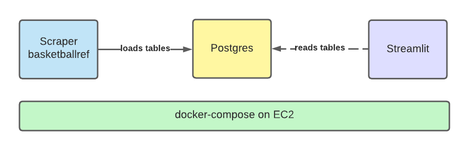

# batch-load-db-dashboard
This is an example repository that uses docker-compose to run a small python-based data pipeline.

### Pipeline Archecture
Python apps are used to scrape a website (basketballreference.com), save the data to a postgres database, and run a dashboard to visualize the data.
There is one container for the python apps, one for postgres, and one for streamlit.




### How to Deploy
Any virtual machine that has docker and docker-compose installed can run this project via the command line by running:
```
git clone https://github.com/jstnck/batch-load-db-dashboard.git
cd batch-load-db-dashboard && docker-compose up
```
You can visit the dashboard by going to [IP:PORT] in your browser
